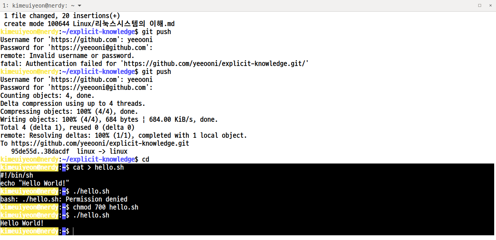

# 리눅스시스템의 이해

###### 쉘 프로그래밍
> 일반적으로 사용하는 명령어들을 몇 개 모아서 하나의 파일로 만들어 실행시키는 프로그램

###### 쉘 스크립트(Shell Script)
> 쉘이 수행하고 있는 명령어들을 저장하고 있는 파일

- 환경 변수
- 특수 변수
- 프로그램 변수



```sh
cat > hello.sh 

#!/bin/sh
echo "Hello World!"
```


```sh
cat > information.sh

#!/bin/sh

# #!<쉘 위치> 와 같은 형식으로 굳이 하지 않아도 무방하나 가장 일반적인 형식이므로 지켜가며 학습하길 권장.

echo " - 시스템 환경 출력 예제 1-1 "
echo -n "HOSTNAME : "
echo $HOSTNAME
echo -n "USER : "
echo $USER
echo -n "NAME : "
echo $NAME
echo -n "SHELL : "
echo $SHELL
echo -n "PWD : "
pwd
echo -n "LS : "
ls
```

```sh
cat > question.sh

#1/bin/sh
echo -n "우리나라의 영문 국가명은?"
read nation

echo -n "우리나라의 국보 1호는?"
read kukbo

echo 영문 국가명 : $nation
echo 국보 1호 : $kukbo
```
