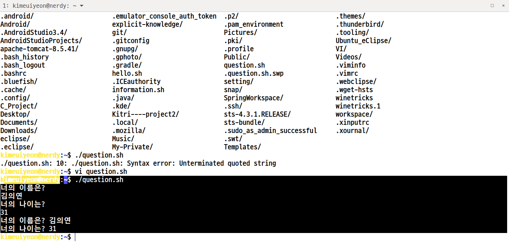
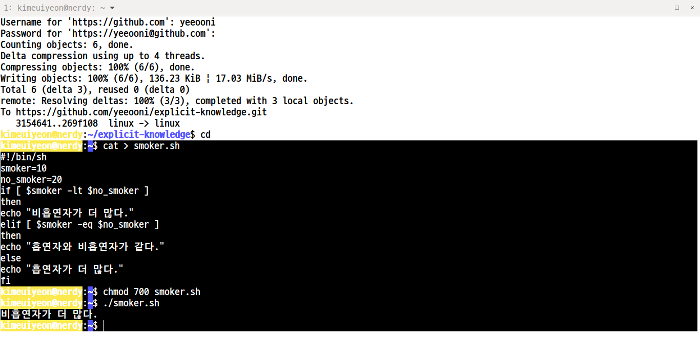

# 리눅스시스템의 이해

###### 쉘 프로그래밍
> 일반적으로 사용하는 명령어들을 몇 개 모아서 하나의 파일로 만들어 실행시키는 프로그램

###### 쉘 스크립트(Shell Script)
> 쉘이 수행하고 있는 명령어들을 저장하고 있는 파일

- 환경 변수
- 특수 변수
- 프로그램 변수


```sh
cat > hello.sh 

#!/bin/sh
echo "Hello World!"
```
---


```sh
cat > information.sh

#!/bin/sh
# #!<쉘 위치> 와 같은 형식으로 굳이 하지 않아도 무방하나 가장 일반적인 형식이므로 지켜가며 학습하길 권장.

echo " - 시스템 환경 출력 예제 1-1 "
echo -n "HOSTNAME : "
echo $HOSTNAME
echo -n "USER : "
echo $USER
echo -n "NAME : "
echo $NAME
echo -n "SHELL : "
echo $SHELL
echo -n "PWD : "
pwd
echo -n "LS : "
ls
```
---


```sh
cat > question.sh

#1/bin/sh
echo -n "우리나라의 영문 국가명은?"
read nation

echo -n "우리나라의 국보 1호는?"
read kukbo

echo 영문 국가명 : $nation
echo 국보 1호 : $kukbo
```
---


```sh
# if 명령과 echo 명령, thon 명령 사용
cat > smoker.sh

#!/bin/sh
smoker=10 #흡연자
no_smoker=20 #비흡연자
if [ $smoker -lt $no_smoker ]
then
echo "비흡연자가 더 많다."
elif [ $smoker -eq $no_smoker ]
then
echo "흡연자와 비흡연자가 같다."
else
echo "흡연자가 더 많다."
fi
```
- 조건문
```sh
# if문 형식

if [ 조건문 ]
then
수행할 명령어

elif [ 조건문 ]
then
수행할 명령어

else 
수행할 명령어
fi

# if 다음에는 조건문이 따라야 하며, then 다음에 수행할 명령어들을 써주어야 하며 다음으로는 fi가 반드시 와야한다. elif, else는 생략가능

# case문 형식
case 변수 in
패턴1 | 패턴2...) 명령어들;;
*) 명령어들;;
esac

# *) Default Action 조건에 맞는 것이 없으면 Default Action을 수행한다.

# for문 형식
for 변수 in list1 list2 list3
do
명령어들
done

# while문 형식
while 조건문
do 
명령어들
done

```


# 프로세스 
- 실행중인 프로그램을 의미한다고 할 수 있다. 
- 커널에 등록되어 커널의 관리하에 들어간 작업
- 작업
  - 사용자가 컴퓨터에서 실행시키기 위하여 작성한 프로그램(컴파일 및 링크가 모두 완료된 실행 프로그램, 실행 파일)과 이 프로그램의 실행에 필요한 입력 데이터를 묶은 것. 프로그램과 이에 필요한 데이터를 의미하는 것 

###### 프로세스 정의
- 커널에 등록되고 커널의 관리하에 있는 작업을 의미
- 실행중인 프로그램
- 각종 자원들을 요청하고 할당받을 수 있는 개체
- 프로세스 관리 블록을 할당받는 개체 

- 프로세스 관련 용어
  - 프로그램 : 특정 기능을 수행하기 위한 명령어의 조합
  - 작업 : 프로그램과 프로그램 실행에 필요한 입력 데이터
  - 프로세스 : 실행중인 프로그램의 인스턴스
  - 프로세서 : 연산을 수행하고 처리하기 위한 자원, 보통 CPU를 말한다.
  - 프로시저 : 프로그램의 일부로 공통적으로 사용되는 특정 루틴
  - 스레드 : 프로세스의 일부 특정 데이터만 가지고 있는 가벼운 프로세스 

###### 프로세스 자원 개념
- 커널에 의해 다른 주체에게 할당되고 이의 사용이 끝날 경우 다시 반납되는 피동적인 개체 

###### 프로세스 관리 블록
- 프로세스 고유 번호 (PID Process Identification Number)
- 프로세스의 우선 순위 : 우선 순위 기반 스케줄링을 하는 경우 필요한 정보  
- 프로세스의 현재 상태
- 프로세스가 할당받는 자원들의 리스트, 이들의 대한 포인터
- 문맥 저장 영역

###### 프로세스 관리의 이해 
1. 생성 상태
2. 준비 상태
3. 실행 상태
4. 대기 상태
5. 지연 상태
6. 지연 준비 상태
7. 지연 대기 상태

###### 프로세스 상태 관리 자료 구조
- 준비 큐, 준비리스트, 대기 큐, 대기 리스트 

###### 인터럽트 처리 및 문맥 교환
- 인터럽트의 종류
  - 입출력 인터럽트 : 프로세스가 요청한 입출려그이 완료 등과 관련하여 발생
  - 클록 인터럽트 : 프로세스의 시간 할당량 종료와 관련하여 발생
  - 콘솔 인터럽트 
  - 프로세스간 통신 인터럽트 
  - 시스템 호출 인터럽트
  - 프로그램 검사 인터럽트 : 프로그램의 실행중 논리적인 오류로 인하여 발생
  - 하드웨어 검사 인터럽트

- 인터럽트 처리 과정
1. 인터럽트 발생 원인 파악
2. 서비스 결정 
3. 인터럽트 서비스 루틴 호출 

- 문맥 보존 및 문맥 교환
  - 문맥 : 특정 프로세스, 관련된 정보의 총집합
  - 문맥 보존 : 실행중인 프로세스의 레지스터 문맥을 보존하기 위하여 저장하는 일
  - 문맥 재적재 : 기존에 저장되었던 문맥을 프로세서로 다시 이동시키는 일 
  - 문맥 교환 : 한 프로세스의 문맥을 저장하고 그의 실행을 중지시킨 후 다른 프로세스의 문맥을 재적재하여 실행해시키는 일 

###### 프로세스 스케줄링의 개요 
- 다중프로그래밍 : 한 개 혹은 여러 개의 프로세서를 가진 컴퓨터 시스템에서 여러 개의 프로세스들을 동시에 운영하는 기법
  - 시간 분할 기법, 공간 분할 기법 
  - 시간 분할 기법 : 여러 프로세스들이 동시에 작업을 수행할 때 같은 자원에 대해 번갈아 사용하게 하는 기법

- 스케줄링 : 특정 자원에 대해 그 자원을 요청하고 있는 대상들 중 할당 순서를 결정하는 일 

###### 스케줄링의 목적
- 시스템의 성능 지표
  - 응답 시간 
  - 자원 활용도
  - 작업 처리 능력

- 응답 시간 : 사용자가 프로그램이나 명령을 입력하는 시간부터 해당 프로그램이나 명령의 실행이 종료되어 그 결과가 사용자에게 보여지는 시간까지의 경과 시간을 의미 
- 작업 처리 능력 : 단위 시간에 얼마나 많은 프로세스들을 처리하여 종료시키는지를 나타내는 성능 지표

- 일반 컴퓨터 시스템 운영체제 성능 지표
  - 공평성
  - 작업 처리 능력
  - 평균 응답 시간
  - 예측성
  - 자원 활용도
  - 무기한 연기 방지

###### 스케줄링 기준
- 프로세스의 속성
  - 입출력 위주 프로세스 : 보조 기억 장치, 입출력 장치와의 데이터 이동에 대부분 시간 소요

- 시스템의 속성
  - 일괄 처리 시스템 : 작업 처리 능력 중요
  - 대화형 시스템 : 응답 시간 중요 

- 신속한 응답 시간의 중요성 

- 프로세스의 우선 순위

- 프로세스의 총 실행 시간 

- 프로세스의 활용 목적

###### 스케줄링의 단계
- 장기 스케줄링 : FIFO
- 중기 스케줄링 : 주기억 장치를 할당받지 못하고 있는 프로세스들에 대해 결정 
- 단기 스케줄링 : 준비 상태에 있는 프로세스들을 대상으로 할당 결정
  - 입출력 인터럽트
  - 클록 인터럽트
  - 시스템 호출 

###### 스케줄링 기법
- 선점/비선점 정책
  - 비선점 스케줄링 정책 : 한 프로세스가 프로세서 등의 자원을 할당받았을 경우, 그 자원을 스스로 반납할 때까지 계속 그 자원을 사용하도록 허용하는 정책, 프로세스의 종료 시간을 비교적 정확하게 예측할 수 있으나 우선 순위가 일시적으로 지켜지지 않을 수 있으며 평균 응답시간이 늦어질 수 있다.
  - 선점 스케줄링 정책 : 운영체제가 프로세서 등의 자원을 할당받고 있는 프로세스로부터 그 자원을 선점하여 다른 프로세스에 할당해 줄 수 잇으도록 허용하는 정책, 대화형으로 운영되는 시분할 시스템이나 실시간 시스템 등에 적합

- 우선 순위
  - 프로세스의 중요도를 숫자로 표현한 것
  - 정적 우선 순위
  - 동적 우선 순위
  - 매입 우선 순위
