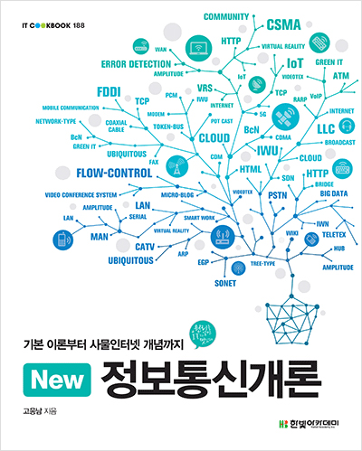
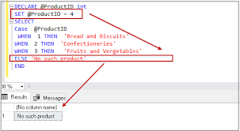
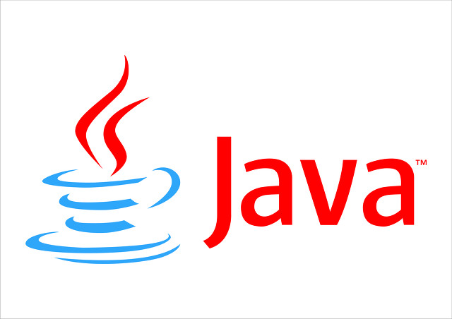

# :pushpin: 연이가 공부할 때 까먹지 않도록 저장해놓은 지식저장소:smile:   **완벽보단, 꾸준히.**

|정보보안|알고리즘|
|:------:|:------:|
|||

|빅데이터|Spring|
|:------:|:----:|
|||

|정보통신개론|MD|
|:----------:|:-:|
|||

|운영체제|SQL|PostgreSQL|
|:------:|:-:|:--------:|
||||

|Java|Git|
|:--:|:-:|
|||

|JavaScript|
|:--------:|
||

---
# Reference

1. [git 한글 파일명 사용문제 고치기 core.quotepath](https://edykim.com/ko/post/git-fix-problem-using-filename-core.quotepath/)  
2. [Ubunto Git 사용법](https://dejavuwing.tistory.com/entry/Ubuntu-GitHub-%EC%82%AC%EC%9A%A9%EB%B2%95)
3. [MarkDown 이모지 사용법](https://www.webfx.com/tools/emoji-cheat-sheet/)
4. [MarkDown 에디터](https://pandao.github.io/editor.md/en.html)
5. [누구나 쉽게 이해할 수 있는 git 입문](https://backlog.com/git-tutorial/kr/)
6. [XShell 6](https://www.netsarang.com/ko/xshell-all-features/)

###### 5. 데이터베이스
- 정규화(Normalization)
