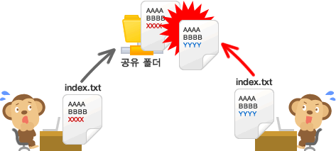
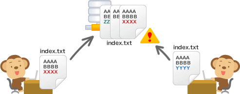
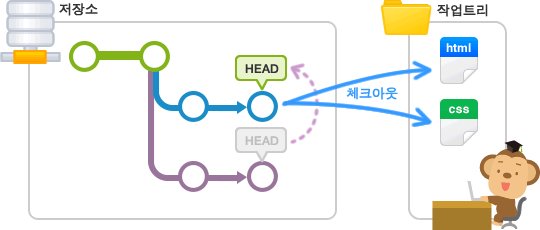

# 1. 시작하기 
[img : 누구나 쉽게 이해할 수 있는 GIT 입문](https://backlog.com/git-tutorial/kr/) 

> git이란 소스코드를 효과적으로 관리하기 위한 *'분산형 버전 관리 시스템'*  
> 원래는 Linux 소스코드를 관리할 목적으로 개발되었다.



> 여러 명이 공유한 파일을 동시에 편집하는 과정에서 충돌이 일어난다.  
이런 문제를 해결하기 위해 만들어진 것이 Git과 같은 버전 관리 시스템이다.



# 2. 저장소(Git Repository)

> 말그대로 파일이나 폴더를 저장해 두는 곳이다.  
> Git 저장소가 제공하는 가장 좋은 점은 파일이 변경 이력 별로 구분되어 저장된다는 점이다. 


# 3. 브랜치(Branch)

> 소프트웨어를 개발할 때 개발자들은 동일한 소스코드를 함께 공유한다.  
동일한 코드위에서 개발자들마다 수정과 새로운 기능을 만들어낸다.  
이럴 때, 동시에 다양한 작업을 할 수 있게 만들어 주는 기능이 *\'branch\'* 이다.  
브랜치란 독립적으로 어떤 작업을 진행하기 위한 개념이다.  


> 이렇게 만들어진 브랜치는 다른 브랜치와 병합(Merge)로, 작업한 내용을 다시 새로운  
하나의 브랜치로 모을 수 있다.

+ 마스터 브랜치 (Master Branch)
> 저장소를 처음 생성하게되면, master라는 이름의 브랜치를 만들어 준다.  
이 새로운 저장소에 새로운 파일을 추가하거나 파일의 내용을 변경하여 그 내용을  
저장(커밋,Commit)하는 것은 모두 *\'master\'* 라는 이름의 브랜치를 통해 처리한다.  

+ 브랜치 전환하기

> 현재 선택된 브랜치가 아닌 다른 브랜치에서 작업을 하고 싶을 때, *\'체크아웃(checkout)\'*  
명령어를 실행하여 원하는 브랜치로 전환할 수 있다. 체크아웃을 실행하면, 우선 브랜치  
안에 있는 마지막 커밋 내용이 작업 트리에 펼쳐진다. 브랜치가 전환되었다면 이 후에 실행한 커밋은  
전환한 브랜치에 추가된다.  
**HEAD**란 현재 사용 중인 브랜치의 선두 부분을 나타내는 이름이야.  
머리라고 생각하면 두 눈이 달려있잖아? 눈으로 바라보는 그 시각을 뜻한다고 생각하면 되.  
기본적으론 master의 선두 부분을 나타내지. 


+ 브랜치 생성 
> 나는 브랜치를 나누기 귀찮아서... 누구나 그럴테지?  
master에 하나에 모든 소스를 주입하는 방식으로 사용했었는데.  
키트리를 다니면서까지도 아무생각없이 사용하다가 막상 취업이 되고 현업에 오게되니  
형상관리시스템을 사용하는 가장 큰 목적이 소스관리와 협업인데, 당연히 너무 괄시하고 멸시했다고 생각이 들어.  
가장 큰 이유는 빌어먹을 귀찮아서일테지만.  
그렇기에! 반성하는 의미로 이 저장소를 정리하면서 브랜치를 나누어 관리할 예정이고, 개발이 끝나면  
**병합(merge)** 혹은 **리베이스(rebase)** 할 것이다. 현재 Develop_git 으로 나누었고,  
브랜치를 생성하는 방법을 간단히 적어보겠다.  

```
git branch <브랜치명>
//브랜치를 생성하는 구문이다.
```

```
git checkout -b <브랜치명>
//위와 같이 적어준다면, 브랜치를 만드는 동시에 해당 브랜치로 체크아웃을 해준다.
```

```
//하지만 내가 생성한 이 브랜치는 로컬(local)과 저장소의 remotem branch가 생성되어 있지않아서, 
git push 명령어를 사용하지 못했다.

[오류내용] 
kimeuiyeon@nerdy:~/explicit-knowledge$ git push
fatal: The current branch Develop_git has no upstream branch.
To push the current branch and set the remote as upstream, use

    git push --set-upstream origin Develop_git

```

```
git branch --set-upstream origin <브랜치명>
```

> 이 문제는 위와 같이 명령어를 입력하여 해결하였다. 브랜치를 생성한다음 _꼭꼭꼭_  
각자가 local 및 저장소 기준이므로, local의 branch를 remote branch와 연동하는  
작업을 해주어야 한다. 

+ 병합(merge)
> 브랜치와 브랜치를 합친다라는 개념이라는건 다들 알고 있겠지.  
몰라도 되. 합친다는 것만 알고 있다면 말이야.
우선 하나의 기능의 개발이 끝나면 마스터브랜치로 체크아웃을 하고 명령어를 입력할꺼야.
```
git merge <생성했던 브랜치명>

//그 전에 pull-request를 이용하여 master에서 conflict등의 오류가 없는지 확인하는게 좋다.
git pull-request
```


