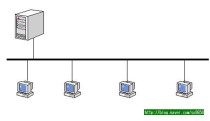
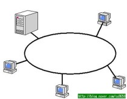
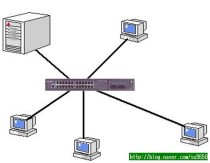
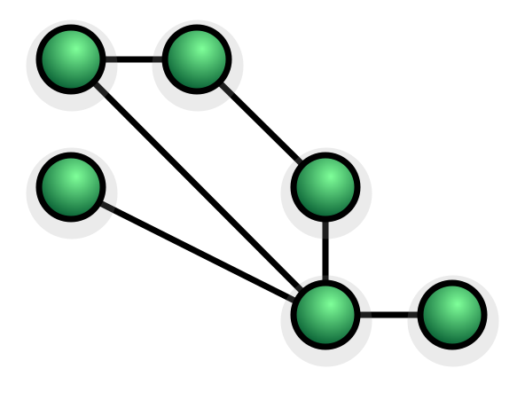

# Network Topology 

> 근거리통신망을 구성할 때   
각 컴퓨터들을 여러가지 형태로 연결하여 구성하는 형태, 네트워크요소들을 물리적으로   
연결해놓은 것. 연결방식

* Bus Topology : 개방된 케이블에 컴퓨터들이 연결
  * 장점 : 구조가 간단, 비용이 낮음, 추가 및 삭제 용이
  * 단점 : 무분별하게 추가할 경우 통신성능이 낮음, 특정부분이 고장이 나면 전체 네트워크 영향

{: width="25%" height="25%}
* Ring Topology : 동그란 형태로 연결되어있는 케이블에 차례로 연결
  * 장점 : 재구성이 쉽다.
  * 단점 : 링한 부분에 문제 발생 시 전체 네트워크에 영향

* Star Topology : 중앙에 위치한 기기를 중심으로 사방에 기기들이 연결
  * 장점 : 메시형에 비해 설치를 하거나 재구성 간편
  * 단점 : 허브가 고장나면 전체 네트워크에 영향

* Tree Topology : Bus + Star 
> 다수의 버스방식을 허브, 스위치를 이용하여 나무에서 가지가 뻗어나가는 형태로 연결  
허브만 준비되어 있으면 쉽게 연결, 스타형처럼 허브가 고장나면 통신이 안된다.

* 하이브리드 Topology : 둘 이상의 토폴로지를 결합하여 전체 네트워크를 구성하는 형태  
실무에서 많이 사용하는 구조.  
성형-버스 토폴로지와 성형-링 토폴로지를 많이 사용.

* mesh Topology : 각각의 노드가 네트워크에 대해 데이터를 릴레이하는 네트워크 토폴로지.
> 모든 메시 노드들은 네트워크 내의 데이터 분산에 협업한다.  
무선과 유선망에 모두 적용이 가능하다.

# 네트워크 교환 방식 

> 다양한 토폴로지로 구성된 소규모의 단위 네트워크를 교환기로 연결하여 대규모의 네트워크를 구성하는   
네트워크 구성방식. 회선 절약 및 유지보수면에서 효율적

1. 회선교환네트워크(Circuit Switching) : 음성데이터를 송수신하기위한 설계 기술
  + 연결설정 -> 데이터전송 -> 연결해제
  + 장점 : 송수신하는 과정에서 네트워크 지연이 발생하지 않는다.
  + 단점 : 음성데이터를 송수신하기 위해 전용채널을 할당 -> 음성데이터가 없는 경우 채널 낭비

2. 패킷교환 : 비음성데이터 송수신 최적의 전송경로를 선택하는 라우팅 기능
  + data -> paket 단위로 전송 통신채널 효율적 공유
  + 장점 : 여러 목적지로 동시에 전송, 오류제어 및 흐름제어를 통해 정확한 데이터 전송보장
  + 단점 : 재정렬 시간 필요

3. 네트워크교환

